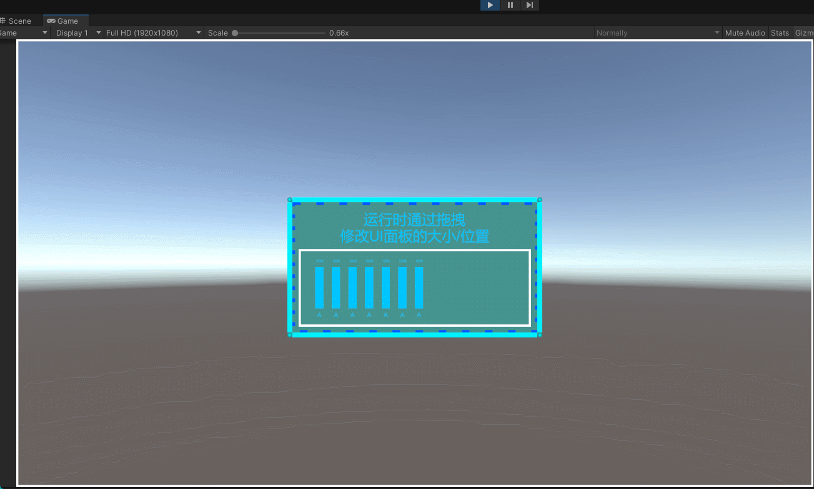

# EditUGUIInRuntime

运行效果图如下：


# PlanA
## 识别修改意图
- 在目标内部/四周/对角"吸附"着UGU的Image组件，作为意图检测的触发器

- 并用脚本组件指定其触发的响应机制类型
## 响应修改意图

# PlanB
## 识别修改意图
- 不使用UI作为触发器,实时计算出UI内部/四周/四角检测区域的```rect```
- 通过使用```rect.contains(point)```的方式来判定光标当前处于哪个触发器区域
## 响应修改意图


# TODO
- [ ] 添加锚点功能
- [ ] 当光标靠近UI面板边界时，光标切换到对应样式
    - 比如：光标靠近右上角时，光标将变化为正向倾斜的样式
- [x] 测试再安卓手机端的运行情况

    <font color="orange">可以正常运行，就是不显示光标</font>
- [ ] 实现PlanB，并测试其性能
- [ ] 比较PlanB和PlanA的性能
- [ ] 实现接口```ILimitUGUIInParentArea```，将当前UI限制在父UI内部，不允许出界。扩展细节：允许设置当前UI与父UI四周保持的最低间距
